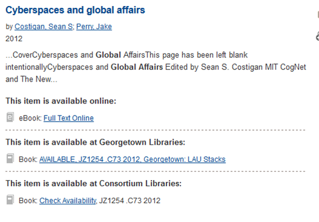

# Summon 2.0 Customization

This code is used by Georgetown University Library to customize the display of Summon 2.0.

## This code accomplishes the following 
* Style page in accordance with University Visual Identity guidelines
* Clarify ArtStor usage
* Simplify link bar to re-use existing library website links
* Group Summon Results (Online holdings, University Holdings, Consortial Holdings)
* Style grouping elements to be inserted

### Notes about Result Groupings
* Summon results display on a single page
* Content is appended as user scrolls
* Page content could get very large
* Need to mark results that have already been processed
* Need to process markup that is added later

#### Before Grouping

#### After Grouping

### Additional Information
[Hacking Summon 2.0 - Presentation to the Washington Research Library Consortium](https://drive.google.com/a/georgetown.edu/folderview?id=0B6H9N0_0aU-oY25NSF9XZ2diUW8&usp=sharing#)
